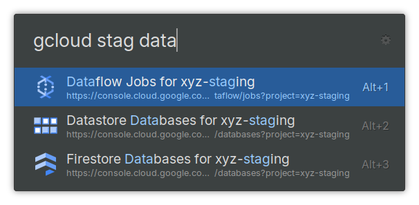
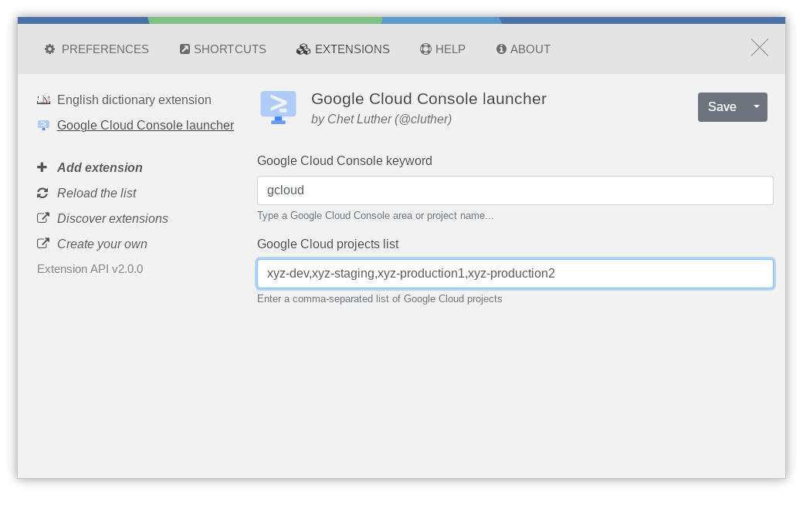

# ulauncher-google-cloud-console

This is a [Ulauncher](https://ulauncher.io/) extension to open [Google Cloud Console](https://console.cloud.google.com) to a specific area and project.





## Usage

Usage is as simple as typing the configured keyword (default is `gcloud`)
followed by space or enter. This will present you with the top list of areas.
Choosing any result will take you to it in your default web browser. As you
type additional letters after the keyword, the list of results will be filtered
to those that contain what you've typed.

### Projects

Project support is what differentiates this extension from the others described
below. By entering a comma-separated list of projects in the extension's
preferences, you web browser can be opened to the desired area within your
choice of project.

For example, let's say you have added `xyz-dev,xyz-prod1,xyz-prod2` into the
projects preference. When you type `gcloud prod logs` you will be presented
with the following two options.

- Logs for xyz-prod1
- Logs for xyz-prod2

## Supported Services

The list of supported Google Cloud services and areas within those services is
maintained within this project, and will probably never be complete. It's easy
to add new services and areas by adding to the `AREAS` dictionary in `main.py`,
and I encourage pull requests that do so.

Currently the supported services and areas are the following.

- Artifact Registry – Repositories
- Bigtable – Instances
- Billing
- Compute – Overview
- Compute – VM Instances
- Dataflow – Jobs
- Datastore – Databases
- Filestore – Instances
- Firestore – Databases
- IAM & Admin – IAM
- IAM & Admin – Service Accounts
- Kubernetes Engine – Kubernetes clusters
- Monitoring – Overview
- Monitoring – Dashboards
- Monitoring – Metrics explorer
- Monitoring – Logs explorer
- Monitoring – Alerting
- Monitoring – Incidents
- Network Services – DNS Zones
- Network Services – Load Balancing
- Pub/Sub – Overview
- Pub/Sub – Topics
- Pub/Sub – Subscriptions
- Pub/Sub – Lite Reservations
- Pub/Sub – Lite Topics
- Pub/Sub – Lite Subscriptions
- SQL – Instances
- Storage – Overview
- Storage – Buckets

## Similar Projects

As of now (2025-01-25) there are two other extensions that do a similar thing
to this one.

- [Google Cloud Extension](https://ext.ulauncher.io/-/github-dhollinger-ulauncher-gcp)
- [GCP Launcher](https://ext.ulauncher.io/-/github-zeue-ulauncher-gcp)

As far as I can tell, their features are the same. However, the GitHub
repository associated with _GCP Launcher_ is no longer available.

The reason I created yet another plugin for opening Google Cloud Console is
because in my daily work I work with many different Google Cloud services, and
in many different Google Cloud projects. The aforementioned extensions don't
offer a way to open a page for the correct project, and that's always what I
want to do.

## Hacking

Notes for those who might want to contribute to this extension

### Icons

I capture the icons for the areas from the SVG used on
https://console.cloud.google.com. However, those are typically greyscale and
use transparencies and use a background of #1967d2 to achieve the blue color
when active. The problem is that this doesn't end up looking right when used
with any of Ulauncher's dark themes. So I replace the transparency with a
specific color from Google's blue palette.

How to replace greyscale colors with their blue counterparts:

- #4285f4 (dark - replaces #424242)
- #669df6 (medium - replaces #616161)
- #aecbfa (light - replaces #757575)

How to replace base colors and transparency.

- #1967d2 (replaces top-level fill="currentColor")
- #3076d6 (replaces opacity=".9")
- #4785db (replaces opacity=".8")
- #75a4e4 (replaces opacity=".6")
- #a3c2ed (replaces opacity=".4")
- #bad2f2 (replaces opacity=".3")

When replacing the base and transparency style icons that are used for
sections, I find the following `vim` command useful. Yank it into your `v`
register with `"vy`, then execute it in the SVG buffer with `:@v`.

```vimrc
%s/ aria-hidden=\"true\"//ge
\ | %s/fill=\"currentColor\"/fill=\"#1967d2\"/ge
\ | %s/\(fill-\)\=opacity=\".9\d*\"/fill=\"#3076d6\"/ge
\ | %s/\(fill-\)\=opacity=\".8\d*\"/fill=\"#4785db\"/ge
\ | %s/\(fill-\)\=opacity=\".7\d*\"/fill=\"#5e94df\"/ge
\ | %s/\(fill-\)\=opacity=\".6\d*\"/fill=\"#75a4e4\"/ge
\ | %s/\(fill-\)\=opacity=\".5\d*\"/fill=\"#8cb3e8\"/ge
\ | %s/\(fill-\)\=opacity=\".4\d*\"/fill=\"#a3c2ed\"/ge
\ | %s/\(fill-\)\=opacity=\".3\d*\"/fill=\"#bad2f2\"/ge
```

I then generate the PNG that Ulauncher uses using Inkscape as follows.

```sh
inkscape -w 48 --export-type=png name.svg
```
